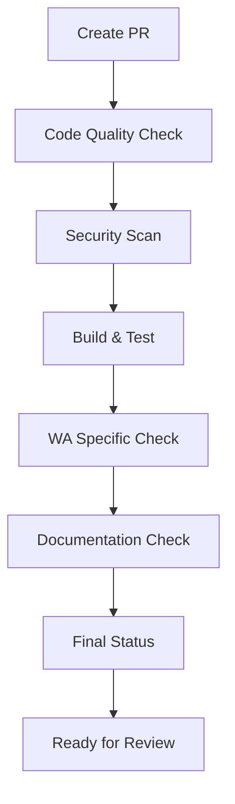
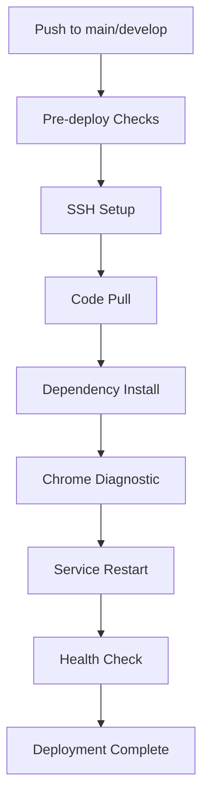

# GitHub Actions Workflows

Repository ini menggunakan GitHub Actions untuk otomatisasi CI/CD, security scanning, dan deployment.

## 🚀 Workflows yang Tersedia

### 1. **Pull Request Checks** (`pull-request.yml`)

**Trigger:** Setiap pull request ke `main` atau `develop`

**Fitur:**
- ✅ Code quality & linting checks
- 🔒 Security & dependency scanning
- 🧪 Build & test validation
- 📱 WhatsApp automation specific checks
- 📚 Documentation validation

**Jobs:**
- `code-quality` - ESLint, Prettier, console.log checks
- `security` - npm audit, vulnerability scanning
- `build-test` - Build process & test execution
- `wa-specific` - WhatsApp automation validation
- `docs` - Documentation completeness check
- `status` - Final status report

### 2. **Deploy to Server** (`deploy.yml`)

**Trigger:** Push ke `main` atau `develop`

**Fitur:**
- 🔍 Pre-deploy security checks
- 🚀 Automated deployment via SSH
- 🔄 Service restart & health checks
- 📊 Deployment verification
- 📝 Comprehensive deployment summary

**Deployment Process:**
1. Pre-deploy validation
2. SSH connection setup
3. Code pull & dependency install
4. Chrome diagnostic check
5. Service restart (PM2/systemctl/manual)
6. Health check verification
7. Post-deploy validation

### 3. **Security Scan** (`security.yml`)

**Trigger:** 
- Daily at 2 AM UTC (scheduled)
- Push to `main`/`develop`
- Pull request to `main`/`develop`
- Manual trigger

**Fitur:**
- 🔍 Dependency vulnerability scan
- 🛡️ Code security analysis
- ⚙️ Configuration security check
- 📱 WhatsApp-specific security
- 📊 Comprehensive security report

**Security Checks:**
- npm audit (moderate+ vulnerabilities)
- Hardcoded secrets detection
- Console.log in production
- eval() usage detection
- XSS vulnerability checks
- Environment file security
- Authentication strategy validation

## 🔧 Setup Requirements

### **Repository Secrets**

Tambahkan secrets berikut di repository settings:

```bash
# SSH Authentication
SSH_PRIVATE_KEY          # Private key untuk SSH ke server
SSH_USER                 # Username SSH (e.g., root, ubuntu)
SERVER_IP                # IP address server deployment

# Optional (untuk enhanced security)
NPM_TOKEN                # NPM registry token
GITHUB_TOKEN             # GitHub token untuk enhanced access
```

### **Server Requirements**

Server deployment harus memiliki:

```bash
# Node.js & npm
node --version           # v18+ recommended
npm --version            # 8+ recommended

# Git
git --version

# Service Manager (optional)
pm2 --version           # PM2 process manager
# atau
systemctl --version     # systemd service manager

# Network access
curl --version          # Untuk health checks
```

## 📋 Workflow Execution

### **Pull Request Flow:**



### **Deployment Flow:**



## 🎯 Best Practices

### **Untuk Developers:**

1. **Buat PR ke develop** untuk fitur baru
2. **Pastikan semua checks pass** sebelum merge
3. **Review security warnings** dan fix jika perlu
4. **Update documentation** saat ada perubahan API

### **Untuk Maintainers:**

1. **Review security reports** secara berkala
2. **Monitor deployment logs** untuk issues
3. **Update dependencies** secara regular
4. **Maintain server access** dan credentials

## 🚨 Troubleshooting

### **Common Issues:**

#### **Pull Request Checks Failed:**
```bash
# Check logs di Actions tab
# Fix linting issues
# Update dependencies jika ada vulnerabilities
# Ensure proper error handling
```

#### **Deployment Failed:**
```bash
# Check SSH connectivity
# Verify server permissions
# Check service manager status
# Review server logs
```

#### **Security Scan Issues:**
```bash
# Run npm audit fix
# Remove hardcoded secrets
# Update vulnerable packages
# Review authentication strategy
```

### **Manual Triggers:**

```bash
# Re-run failed workflow
# Trigger security scan manually
# Re-deploy specific branch
# Check workflow status
```

## 📊 Monitoring & Metrics

### **Workflow Status:**
- ✅ **Success Rate** - Track successful deployments
- ⏱️ **Execution Time** - Monitor workflow performance
- 🔒 **Security Score** - Track vulnerability trends
- 📱 **WA Health** - Monitor service status

### **Deployment Metrics:**
- 🚀 **Deployment Frequency** - How often code is deployed
- 🔄 **Rollback Rate** - Failed deployments requiring rollback
- ⚡ **Deployment Time** - Time from push to production
- 🎯 **Success Rate** - Percentage of successful deployments

## 🔗 Related Documentation

- [WhatsApp Automation API](./src/routes/README_WA_AUTOMATION.md)
- [Project Structure](../STRUCTURE.md)
- [Main README](../README.md)
- [Environment Setup](../env.example)

---

**Note:** Semua workflows menggunakan Node.js 18 dan Ubuntu latest runner untuk konsistensi dan keamanan.
